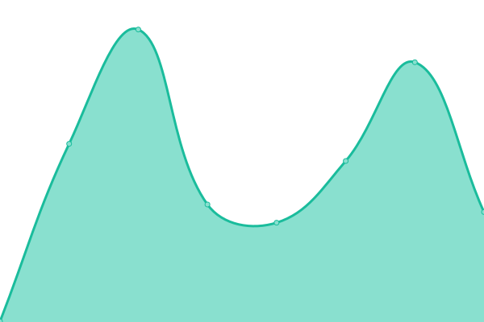

# [📈 Live Status](https://uptime.andrewnet.net): <!--live status--> **🟧 Partial outage**

This repository contains the open-source uptime monitor and status page for [Upptime](https://upptime.js.org), powered by [Upptime](https://github.com/upptime/upptime).

With [Upptime](https://upptime.js.org), you can get your own unlimited and free uptime monitor and status page, powered entirely by a GitHub repository. We use [Issues](https://github.com/upptime/upptime/issues) as incident reports, [Actions](https://github.com/andrewnyr/uptime/actions) as uptime monitors, and [Pages](https://uptime.andrewnet.net) for the status page.

<!--start: status pages-->
<!-- This summary is generated by Upptime (https://github.com/upptime/upptime) -->
<!-- Do not edit this manually, your changes will be overwritten -->
<!-- prettier-ignore -->
| URL | Status | History | Response Time | Uptime |
| --- | ------ | ------- | ------------- | ------ |
|  [andrewnet](https://www.andrewnet.net) | 🟩 Up | [andrewnet.yml](https://github.com/andrewnyr/uptime/commits/HEAD/history/andrewnet.yml) | 

 184ms
     
 | 

<a href="https://uptime.andrewnet.net/history/andrewnet">100.00%</a>
    

|  andrewnet authentication | 🟥 Down | [andrewnet-authentication.yml](https://github.com/andrewnyr/uptime/commits/HEAD/history/andrewnet-authentication.yml) | 

 122ms
     
 | 

<a href="https://uptime.andrewnet.net/history/andrewnet-authentication">100.00%</a>
    

|  [andrewnet cloud cdn](https://cloud.cdn.andrewnet.net) | 🟩 Up | [andrewnet-cloud-cdn.yml](https://github.com/andrewnyr/uptime/commits/HEAD/history/andrewnet-cloud-cdn.yml) | 

 141ms
     
 | 

<a href="https://uptime.andrewnet.net/history/andrewnet-cloud-cdn">100.00%</a>
    

|  [nextcloud](https://nxtc.andrewnet.net/) | 🟥 Down | [nextcloud.yml](https://github.com/andrewnyr/uptime/commits/HEAD/history/nextcloud.yml) | 

 0ms
     
 | 

<a href="https://uptime.andrewnet.net/history/nextcloud">100.00%</a>
    

|  [njit website](https://web.njit.edu/~aja9/) | 🟥 Down | [njit-website.yml](https://github.com/andrewnyr/uptime/commits/HEAD/history/njit-website.yml) | 

 430ms
     
 | 

<a href="https://uptime.andrewnet.net/history/njit-website">0.00%</a>
    

<!--end: status pages-->

[**Visit our status website →**](https://uptime.andrewnet.net)

## 📄 License

- Powered by: [Upptime](https://github.com/upptime/upptime)
- Code: [MIT](./LICENSE) © [Upptime](https://upptime.js.org)
- Data in the `./history` directory: [Open Database License](https://opendatacommons.org/licenses/odbl/1-0/)
